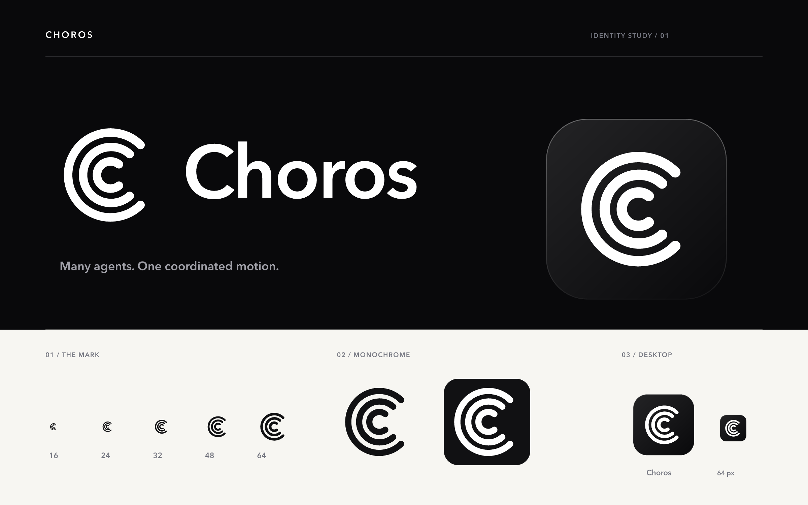

# Choros 品牌素材

已选定的方向：**黑底白色 C 形线条**。三条弧线代表多个 coding agent 协同，logo 和桌面图标使用同一个标记。

当前为设计素材，尚未替换应用中的旧图标。

## 文件

- `choros-identity-preview.png` / `.svg`：整体预览，含黑底白色 logo、桌面图标与小尺寸对照。
- `choros-logo-light.svg` / `.png`：白色 logo，透明背景，用于黑色或深色界面。
- `choros-logo.svg` / `.png`：黑色 logo，透明背景，用于浅色界面。
- `choros-mark.svg` / `.png`：黑色独立标记，透明背景。
- `choros-mark-dark.svg` / `choros-mark-light.svg`：黑色与白色独立标记。
- `choros-app-icon.svg` / `.png`：黑色圆角底板、白色标记；PNG 为 1024 × 1024，底板外透明。
- `choros-app-icon.icns`：macOS 图标，最大 1024 × 1024。
- `choros-app-icon.ico`：Windows 图标，包含 16、24、32、48、64、128、256 像素版本。

## 使用说明

深色背景用白色标记 `#FFFFFF`，浅色背景用近黑标记 `#111113`。桌面图标底板为轻微黑灰渐变，以细边缘高光区分深色桌面。保留图形比例与弧线间距，等比缩放。

字标基于 Avenir Next Demi Bold，已转为路径，不依赖字体安装。SVG 是可编辑源文件；PNG 由 resvg 导出，ICNS 由 macOS `iconutil` 封装。
