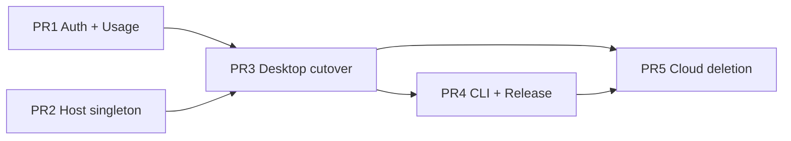

# Plan — 个人登录、本地产品与最小线上服务

## Files that change

下表按代码域列出真实入口；整目录删除用代表路径表达，不逐个枚举其中每个组件。

| File / pattern | Change |
|---|---|
| `packages/db/src/schema/auth.ts` | 把 user/account/session 收窄到 GitHub/Google 登录所需字段，删除 organization/team/deletion/billing/API-key 派生字段。 |
| `packages/db/src/schema/usage.ts`（new） | 定义 strict `usage_events` 表：event ID、derived user ID、event、occurred/received time、app version、platform、schema version。 |
| `packages/db/src/schema/index.ts` | 只导出 auth 与 usage schema，不再聚合旧云产品模型。 |
| `packages/db/src/schema/{schema,github,ingest,leaderboard,relations,types,zod,enums}.ts` | 在最终删除 PR 中移除无消费者的云产品表/类型；若少量 auth 类型仍需要，先迁到 auth/usage 近旁。 |
| `packages/db/drizzle/*` | 仅由 `drizzle-kit generate` 在 fresh Neon branch 上生成 usage additive migration 与最终 destructive cleanup migration；绝不手改或由 agent apply。 |
| `packages/auth/src/server.ts` | 删除 organization、Stripe、API key、JWT、QStash、email/invite、Apple、PostHog 和业务 hooks；保留 GitHub/Google Better Auth、bearer session 与 verified-email 默认 linking。 |
| `packages/auth/src/env.ts`, `packages/auth/package.json` | 环境变量和依赖缩减到 GitHub/Google OAuth、Better Auth、Neon；清除继承的 provider/billing/analytics secrets。 |
| `apps/auth/src/index.ts` | 保留 desktop OAuth kickoff/callback，移除 active organization/IP 持久化，新增 strict authenticated `POST /api/usage/events` Hono route。 |
| `apps/auth/wrangler.toml`, `apps/auth/package.json`, `apps/auth/README.md` | 只保留 OAuth/Neon配置；移除假 secret 与 PostHog/Stripe/Redis/QStash/Resend 说明，更新 endpoint 和本地 smoke runbook。 |
| `scripts/auth-dev-server.ts` | 与 Worker 的 OAuth + usage route 保持行为一致，删除旧组织/业务 API 假依赖。 |
| `apps/desktop/src/renderer/lib/auth-client.ts` | 删除 organization/stripe/api-key/JWT/relay plugins，只保留个人 session bearer 客户端。 |
| `apps/desktop/src/renderer/providers/AuthProvider/AuthProvider.tsx` | 改为“在线刷新优先、已缓存身份可离线继续”的显式状态机，不再 mint relay JWT。 |
| `apps/desktop/src/lib/trpc/routers/auth/**` | 删除 organization ID 缓存与 host 多实例 reconcile；sign-out 只清 auth，不停/删 singleton 本地数据。 |
| `apps/desktop/src/renderer/routes/_authenticated/layout.tsx` | 保留个人登录 gate，删除 active organization/create-org/cloud feature/remote/offline-block 分支，直接挂载 singleton local providers。 |
| `apps/desktop/src/renderer/routes/onboarding/**` | 收窄为模型凭据 + 第一个本地 project，不再写 user onboarding/cloud state。 |
| `apps/desktop/src/renderer/routes/_authenticated/settings/account/**` | 只展示 provider、email/avatar 和 sign-out；删除 profile mutation/avatar upload/account deletion。 |
| `apps/desktop/src/renderer/routes/_authenticated/settings/{organization,teams,members,integrations,api-keys,hosts,permissions,security}/**` | 删除不再存在的云端/协作设置页面及其导航、搜索条目。 |
| `apps/desktop/src/renderer/components/UsageReporter/UsageReporter.tsx`（new） | 每次成功启动生成幂等 `desktop_opened`，有 session 时异步发送；离线事件按 user 绑定地暂存并在同一 user 恢复联网后补发。 |
| `apps/desktop/src/renderer/components/UsageReporter/index.ts`（new） | 导出单一 usage reporter 组件。 |
| `apps/desktop/src/renderer/lib/posthog.ts`, `providers/PostHogProvider/**`, `components/{PostHogUserIdentifier,PostHogSurfaceTagger,TelemetrySync}/**`, `main/lib/analytics/**` | 全部删除；保留业务路径时移除 scattered capture 调用而非替换为新事件。 |
| `apps/desktop/src/renderer/routes/-layout.tsx`, `renderer/index.tsx` | 挂载 AuthProvider + UsageReporter，删除 PostHog provider/pageview 与 database rich-notice gate。 |
| `apps/desktop/src/main/lib/host-service-coordinator.ts` | 从 org-keyed Map/多实例管理器改为真正 singleton；固定一个 connection/process/secret/manifest namespace。 |
| `apps/desktop/src/main/lib/{host-service-manifest,host-service-lock}.ts` | 使用固定 machine-local 路径和无参数 API，删除 organization ID 文件夹与 key。 |
| `apps/desktop/src/main/index.ts`, `main/host-service/{index,env}.ts` | 启动 singleton host，不再等待 membership/token，不传 cloud API/relay/organization env。 |
| `packages/host-service/src/{app,env,serve}.ts` | 删除 outbound cloud `ApiClient`、organization config、relay registration；保留 loopback host auth、本地 DB、Git、terminal、agent/chat。 |
| `packages/host-service/src/api/**`, `providers/auth/{JwtAuthProvider,ConfigFileSessionTokenSource}/**` | 删除 host→cloud API 与 cloud credential providers。 |
| `packages/host-service/src/daemon/{DaemonSupervisor,manifest,singleton}.ts`, `terminal/daemon-client-singleton.ts` | 以单例 namespace 管理 daemon/socket/manifest，删除 organization 参数与 `ORGANIZATION_ID` env。 |
| `packages/host-service/src/db/schema.ts` | 保持 project/workspace/terminal/agent/PR 为唯一业务事实源，删除 `taskId`、cloud backfill、created-by/cloud mirror 字段。 |
| `packages/local-db/src/schema/schema.ts` | 删除旧 project/worktree/workspace、cloud mirror/Electric 表；只保留 browser/UI/settings 等 desktop-only 状态。开发 DB 直接重建。 |
| `apps/desktop/src/renderer/routes/_authenticated/providers/CollectionsProvider/**` | 删除 org/Electric collection lifecycle；保留的纯本地 sidebar/UI 状态迁到最高共享本地 provider/store。 |
| `apps/desktop/src/renderer/hooks/{known-hosts,useRelayUrl}/**`, `hooks/host-{projects,workspaces}/**`, `hooks/useHostsPresence/**` | 删除 remote/relay/known-host fan-out；project/workspace hooks只查询 singleton local host URL。 |
| `apps/desktop/src/renderer/routes/_authenticated/providers/{LocalHostServiceProvider,HostWorkspacesProvider}/**` | 暴露单一 local host connection、projects/workspaces，不再返回 organization/remote target。 |
| `apps/desktop/src/renderer/routes/_authenticated/_dashboard/tasks/**` | 删除 Cloud Task/global Tasks surface；复用的 GitHub Issue UI 搬到 Project 内部后删除其余目录。 |
| `apps/desktop/src/renderer/routes/_authenticated/_dashboard/project/$projectId/**` | 增加 project-scoped Issues/PR 入口，复用 host `gh`/credential、Workspace/Agent 创建流程。 |
| `apps/desktop/src/renderer/commandPalette/ui/LinkTask/**`, `components/IssueLinkCommand/**`, workspace `LinkedTaskSection/**` | 删除 Task UUID 搜索/链接；需要的 repository issue context 改用 provider/repo/number/URL。 |
| `packages/host-service/src/trpc/router/{issues,pull-requests,workspace-creation,workspace}/**` | 保留本机 GitHub Issue/PR → Workspace/Agent；删除 cloud `task.start`、taskId、remote target 分支。 |
| `apps/desktop/src/renderer/routes/_authenticated/_dashboard/automations/**` | 整目录删除 Automation UI、templates、triggers、run history。 |
| `apps/desktop/src/renderer/components/Paywall/**` 及 `GATED_FEATURES` callers | 删除 paywall、plan gating 和被删除云能力入口。 |
| `apps/desktop/src/renderer/lib/{cloud-trpc,api-trpc-client}.ts`, `providers/ElectronTRPCProvider/ElectronTRPCProvider.tsx` | 删除 cloud tRPC client/provider；Electron provider只承载 IPC/local query client。 |
| `packages/cli/src/commands/{organization,hosts,automations,tasks,auth}/**` | 删除云产品命令；如本地 CLI 不需要登录，auth commands一并删除。 |
| `packages/cli/src/lib/api-client.ts`, command registry/meta | 删除 cloud API client和命令注册；保留本机 workspace/terminal/agent/browser/settings 路径。 |
| `packages/trpc/**` | 所有 desktop/host/CLI消费者切走后删除整个 cloud tRPC package，不留空 router。 |
| `apps/desktop/src/main/env.main.ts`, `renderer/env.renderer.ts`, `renderer/index.html` | 清除 streams/relay/PostHog/旧 API CSP；只保留 auth-service URL、version-manifest URL和 disabled-by-default Sentry配置。 |
| `apps/desktop/src/main/lib/sentry.ts`, `renderer/lib/sentry.ts`, `packages/host-service/src/sentry.ts` | 保留 no-DSN no-op 代码，删除 organization tag；验证构建/部署不含 Superset DSN。 |
| `apps/desktop/src/renderer/hooks/useDesktopNotices/**`, `components/DesktopNotices/**`, `desktop-notice-*` stores/docs | 删除 DB rich notice、preview、blocking/pre/post-update 逻辑。 |
| `.github/workflows/release-desktop.yml` | 在 release artifacts 中生成最小 `latest.json`，随 draft release上传，发布后由 stable latest URL 提供。 |
| `apps/desktop/src/main/lib/auto-updater.ts`, `components/UpdatesPill/**` | 使用 `latest.json` 只做非阻断提示；实际下载/签名继续使用 electron-builder 的平台 manifest。 |
| `apps/desktop/src/renderer/routeTree.gen.ts` | 删除/移动 routes 后用 `bun run --cwd apps/desktop generate:routes` 自动重建。 |
| `apps/desktop/package.json`, `packages/{auth,db,host-service,cli}/package.json`, root `package.json`, `bun.lock` | 移除 PostHog、Stripe、Electric、cloud tRPC 和已删除 provider依赖；保留 Better Auth、Neon、Hono、Sentry代码依赖。 |
| `packages/i18n/locales/*/messages.po` | 在功能工作后统一 extract/check，删除旧 cloud 文案并补齐登录/onboarding/version提示翻译。 |

## Order of work

交付采用 5 个有依赖的连续 PR。每个 PR 都必须保持其承诺路径可运行；临时兼容只允许存在于同一 PR 的内部提交，PR 合并态不保留双写、alias 或 deprecated route。

1. **PR 1 — 最小 Auth + Usage 契约（additive）**
   - 在 fresh Neon branch 修改 Drizzle schema，新增 `usage_events` 并生成 additive migration；不 apply 到 shared/prod。
   - 在 auth Worker 和本地 auth dev server实现相同的 strict Hono route、session-derived user ID 与 event-ID 幂等。
   - 收窄 OAuth provider 为 GitHub/Google，并先增加回归测试；本 PR 暂不删除旧 schema，避免尚未切换的客户端断裂。
   - 添加 owner 可复制的只读 DAU SQL 到现有运营 runbook位置；不增加 API/dashboard。

2. **PR 2 — Host 真单例 + Host DB 权威**
   - 将 desktop coordinator、host manifest/lock、host entry、daemon supervisor/socket 从 org-keyed 多实例改为无 ID singleton。
   - 删除 host→cloud ApiClient、JWT provider、relay registration 和 cloud config；保留 loopback PSK/origin/path边界。
   - 以 host DB 的 project/workspace/terminal/agent/PR schema 为唯一业务源，删除 task/cloud mirror字段；重建开发 host DB。
   - 把 renderer 的 local host/project/workspace query targets简化为单 URL，删除 known-host/relay/Electric fan-out。

3. **PR 3 — Desktop 产品切换**
   - 简化 auth client/provider/layout：保留 GitHub/Google 登录，加入离线已登录状态；删除 organization、JWT/relay、cloud provider。
   - 加入 UsageReporter；每次成功启动产生一个事件，严格异步，离线暂存只在同 user session 下补发。
   - 删除 PostHog、Cloud Task、Automation、remote/cloud workspace、paywall与 cloud settings；重建 route tree。
   - 把 GitHub Issue/PR UI 移入 Project，并验证 Issue/PR → Workspace/Agent 仍走本机 host。
   - 收窄 Account 与首次 onboarding；重建 desktop local DB，保留的只是 desktop-only状态。

4. **PR 4 — 本地 CLI + Release/Update**
   - 删除 CLI cloud auth/org/host/task/automation commands与 `@choros/trpc` client，验证 local workspace/terminal/agent命令。
   - release workflow生成并上传最小 `latest.json`；desktop只用它提示版本，electron-builder manifest继续负责下载。
   - 删除 database rich notices；保留 Sentry代码但清空所有默认/部署 DSN，PostHog完全退出。

5. **PR 5 — 最终服务端/依赖删除**
   - 在所有消费者已切走后删除 `packages/trpc`、旧 cloud routers、业务 integrations、billing/automation/task schema与jobs。
   - 在 fresh Neon branch 从最终 schema生成 destructive migration；执行前验证环境身份和旧业务表为空。发现任一非零行立即停止，不 apply。
   - 清理 env、CSP、package依赖、bun lock、dead imports、generated routes和i18n catalogs。
   - 完成全链路 smoke proof后才删除开发数据库和旧本地缓存；永不删除 Git仓库/worktree/普通文件。

依赖关系：PR 1 先于 PR 3；PR 2 先于 PR 3；PR 3 先于 PR 4/5；PR 4 与 PR 5 的准备可并行，但 PR 5 最后合并。

## Risks

- **Auth schema/plugin收缩 — 高 blast radius。** Better Auth inferred types、OAuth callback、bearer desktop session和same-email linking会一起变化。缓解：先做 additive usage PR；用真实 GitHub/Google dev OAuth smoke覆盖两个 provider、重复登录和same-email linking，再删插件。
- **离线身份语义 — 中等概率/高 UX影响。** 网络失败可能被误判成登出，或远端撤权在离线时仍显示已登录。缓解：状态机明确区分 cached/offline、server-authenticated、revoked；本地数据从不以该状态作为安全隔离。
- **Usage事件错归用户 — 中等概率/中影响。** 离线事件在账户切换后补发会归到错误 session。缓解：本地 pending event记录原 user ID但不发送；只在当前 verified user匹配时flush，不匹配则保留/丢弃并测试。
- **清理任务延期 — 确定存在/隐私影响。** 365 天不是实际执行保证。缓解：plan与release notes明确不声称自动删除；创建独立后续工作，禁止悄悄把保留期写成已实现。
- **Host singleton重构 — 高概率/高本地功能影响。** org key同时承担实例隔离、路径、端口、锁和daemon socket namespace。缓解：先固定单例契约和manifest测试，再切 coordinator/daemon，再切 renderer；保留loopback secret与进程归属检查。
- **Host DB权威切换 — 高影响。** v1 local-db 与 host DB存在重复表和v1/v2分支。缓解：产品未发布且允许reset；用合成开发数据验证新建/打开/删除/重启，而非构建复杂迁移。
- **误删Git数据 — 极低容忍度/灾难性。** “允许重置开发数据”只指SQLite/Neon开发行。缓解：删除工具只接受已知DB路径；proof中校验测试Git仓库checksum和worktree目录仍存在；不运行递归用户目录删除。
- **GitHub Issue UI搬迁 — 中等回归风险。** 当前 `/tasks` 混合云Task与host Issues，容易误删共享组件。缓解：先迁移/验证project-scoped Issues/PR flow，再删除Tasks目录；host `gh`调用作为契约测试。
- **旧cloud包删除漏调用方 — 高概率/编译影响。** desktop、CLI、host-service、scripts和docs均有 `@choros/trpc`/`@choros/db`引用。缓解：最终 PR 前 grep依赖根、typecheck所有workspace，删除整个包而非留下stub。
- **版本manifest与electron-updater重复 — 中等UX风险。** JSON只提示，YAML负责下载，版本可能不一致。缓解：同一release job从同一tag生成并同时上传；contract test断言JSON version与artifact/tag一致。
- **Sentry误发Superset — 高隐私风险。** 本地或CI secret可能仍注入旧DSN。缓解：生产构建网络检查、secret名称/部署环境审计和无DSN no-op测试；不在代码中保留任何具体DSN。
- **Destructive Neon migration — 高 blast radius。** 用户认为无数据但环境可能选错。缓解：遵循 db-migrations skill在fresh Neon branch生成；不由agent apply；执行前打印目标project/branch和逐表count，任一非零/未知即停止。

## Proof

### PR 1 — Auth + Usage

- Route contract tests覆盖：无session→401；body含`userId`/未知字段→400；非`desktop_opened`→400；合法请求从session派生user；相同event ID重试只一行；不同ID同user同日保留多行。
- Better Auth集成覆盖 GitHub/Google provider allowlist、无email/password/Apple注册入口、verified same-email隐式链接、未验证/不同邮箱不自动链接。
- 本地启动 auth Worker/dev server，走实际desktop kickoff/callback形状后调用usage endpoint；检查Neon开发分支行只含允许字段。

### PR 2 — Host singleton

- 单元测试覆盖固定manifest/lock/socket路径、重复start去重、crash adoption、stop/restart和无organization env。
- host-service集成 smoke：无`AUTH_TOKEN`、`ORGANIZATION_ID`、`CHOROS_API_URL`、`RELAY_URL`时启动；project create/list、workspace create/open、terminal create/send/read、agent session和PR query正常。
- 网络观察确认 host-service不向Choros cloud/relay发请求；loopback无/错secret仍拒绝，未注册路径仍不可访问。

### PR 3 — Desktop

- 组件/状态机测试覆盖首次在线登录、cached identity离线启动、恢复联网refresh、server revoke、sign-out保留local profile、切换账户不切本地数据。
- UsageReporter测试覆盖每次成功启动一个ID、renderer重渲染不重复、离线排队、same-user flush、different-user不误发、失败fail-open。
- 使用 CDP 驱动真实桌面：GitHub/Google登录后完成精简onboarding；断网重启；创建/打开project/workspace；启动terminal与agent；退出/换账户后本地数据仍在。
- CDP驱动 Project → Issue/PR → Workspace/Agent；确认branch/name/prompt context正确且没有`/tasks`导航。
- 捕获冷启动网络：只允许auth/session、usage、latest.json，以及用户主动触发的provider/update请求；断言无`/api/trpc`、relay、streams、Electric、PostHog和rich-notice请求。

### PR 4 — CLI + Release

- CLI help/snapshot验证只剩本地命令；实际运行projects/workspaces/terminals/agents本地路径，不需要organization/cloud token。
- release workflow contract test用tag生成`latest.json`并校验strict schema、version与tag一致、release URL正确；draft不成为latest，publish后latest URL可读。
- 真实桌面更新 smoke：较新manifest显示非阻断提示；同版无提示；404/invalid/offline静默继续；实际下载仍由签名electron-builder manifest完成。
- 构建产物与运行时网络确认无Superset Sentry DSN、无PostHog；Sentry无DSN初始化为no-op。

### PR 5 — Final deletion

- `bun run typecheck`、受影响package tests、`bun run --cwd packages/i18n check`、route generation和release version check全部通过。
- 依赖/文本门禁：生产代码中无`cloudTrpc`、`apiTrpcClient`、`@choros/trpc`、organization/team/billing/relay/Electric/PostHog旧入口；允许的`organization`仅可出现在历史SDLC/决策文档，不在runtime。
- 在fresh Neon branch检查生成migration的目标表清单；不apply shared/prod。任何未来执行必须先确认目标环境并对旧业务表count=0。
- 完整production-package smoke：在线首次登录、离线重启、本地project/workspace/terminal/agent/chat、Project Issues/PR、usage写入、版本提示、CLI本地命令。
- 数据破坏防线：对合成Git仓库记录checksum和worktree列表，reset开发DB后再次校验完全一致。

### Rollout and rollback

- 产品未发布，不使用feature flag、percentage rollout或兼容shim；每个PR只在其纵向路径验证通过后合并。
- PR 1 migration是additive，可通过回退应用代码停止写入；PR 5 destructive migration在代码稳定和空表证据之后单独生成/审查，不由agent apply。
- Desktop/host/CLI统一版本继续锁步发布。任一真实smoke失败即停止后续PR或release，回退最近一个PR；不要用数据库restore替代代码回退。
- Sentry默认关闭，因此首发监控只依赖auth Worker结构化日志、OAuth成功/失败状态、usage route 2xx/4xx/5xx计数和手工DAU SQL；日志不得含token、request body或PII。
- 365天自动清理不在本plan交付范围；必须作为独立后续工作跟踪，在实现前不得宣称retention已自动执行。

## Author + Status

- **Author:** copilot
- **Status:** `accepted` — engineer/product owner 于 2026-09-03 接受 5 个连续 PR、真实流程验证和已列高风险
